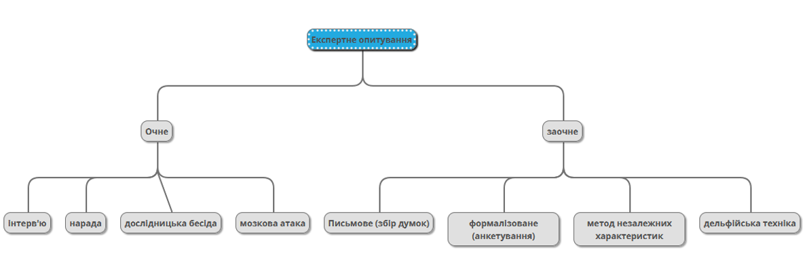
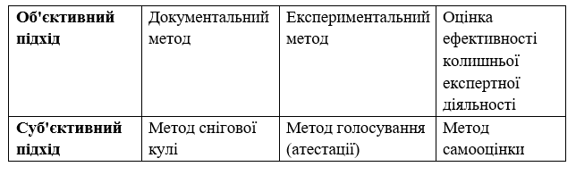
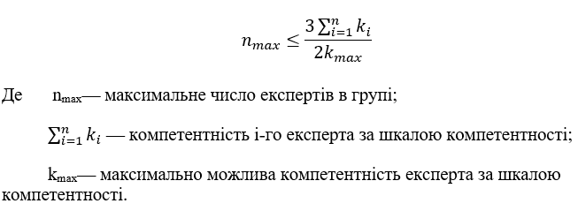
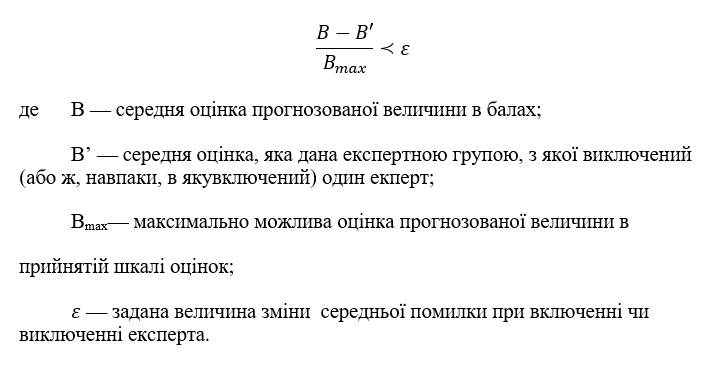
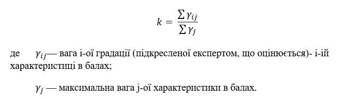
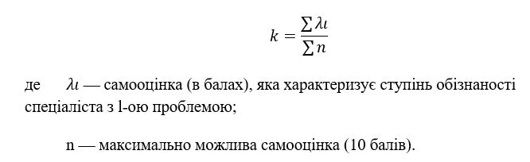

# Оцінювання конфліктності експертних думок за результатами експертного опитування
Відомо, що підходи до прогнозування обстановки застосовні хіба що для більш-менш стабільних умов функціонування керованих систем і то на невеликому часовому відрізку. У сучасних умовах динамічної зміни ситуацій, конкурентної протидії на всіх рівнях активності та взаємодії і різких коливань безлічі інших показників достовірний інтервал прогнозу стискається практично до відсутності самого змісту слова "прогноз".  Керівництво, як правило, оперує малодостовірною картиною очікувань і змушене орієнтуватися винятково на власний досвід та інтуїцію під час їх оцінки. У деяких випадках під час розв'язання завдань із вкрай великим ступенем невизначеності застосовують технології збирання й опрацювання експертних думок, що базуються на індивідуальному досвіді та знаннях осіб, яких залучають як експертів.
## 1. ОСНОВИ ЕКСПЕРТНОГО ОПИТУВАННЯ 
## 1.1 Означення та мета експертного опитування

Експертне опитування - різновид соціологічного опитування, в ході якого респондентами виступає особливий тип людей - експерти. Це компетентні особи, які мають глибокі знання про предмет або об'єкт дослідження.[1]
Проще кажучи, експертне опитування це є метод дослідження, який використовується для збору думок, оцінок та експертних знань від кваліфікованих фахівців у певній галузі з метою отримання обґрунтованих інформаційних даних та прийняття обґрунтованих рішень.
Мета експертного опитування:
-	Збір експертних думок та знань: Головна мета експертного опитування полягає в отриманні думок, оцінок, інсайдерської інформації та спеціалізованих знань від експертів у конкретній галузі або предметній області. Експерти можуть мати великий досвід і експертні знання, які є важливим джерелом інформації для прийняття рішень.
-	Оцінка та порівняння думок: Експертне опитування дозволяє оцінити різні думки та точки зору експертів, виявити суперечливість, консенсус або розбіжності між ними. Це дозволяє ідентифікувати ключові питання, на яких експерти можуть не згоджуватись, і розробити стратегії для подальшого розгляду та вирішення конфліктів.
-	Вирішення проблем та зменшення невизначеності: Експертне опитування може допомогти вирішити складні проблеми або зменшити невизначеність, пов'язану зі збором інформації. За допомогою думок і знань експертів можна отримати більш повне уявлення про ситуацію, що дозволяє зменшити ризики та забезпечити кращі результати прийняття рішень.
На жаль, експертне опитування або метод експертних оцінок має недоліки, які провокують недовіру до одержуваних результатів. По-перше, експерти-консультанти на практиці, як правило, не несуть відповідальності за якість прогнозу. По-друге, отримані під час їхньої роботи оцінки мають суб'єктивний характер, причому результати істотно залежать від складу групи експертів. І по-третє, принцип узгодженості думок, який застосовують під час підбиття остаточних підсумків, по суті, сприяє відсіюванню нестандартних, але часто вкрай корисних, пропозицій і обмежує можливість виходу за рамки панівних стереотипів.[6]

## 1.2 Види експертного опитування

Види експертного опитування можуть варіюватись залежно від цілей дослідження та характеру інформації, яку необхідно зібрати. Основні види експертного опитування наведені нижче[1]:
Опис деяких з них:

-	Інтерв'ю з експертами: У цьому виді опитування експерти запитуються за певною структурою, що дозволяє зібрати детальну інформацію про їх думки, досвід та переконання. Інтерв'ю може бути проведене особисто, по телефону або за допомогою онлайн-платформ. Цей підхід дозволяє отримати глибину інформації та зрозуміти мотиви за оцінками експертів.
-	Делфі-метод: Суть цієї форми експертного оцінювання - у проведенні ряду послідовних конфіденційних опитувань групи експертів з досліджуваної проблеми у кілька турів. Його мета – формування узгоджених думок на основі багаторазового опитування одних і тих же експертів. Після першого опитування та узагальнення результатів підсумки повідомляються учасникам експертної групи. Потім проводиться повторне опитування, в ході якого експерти або підтверджують свою точку зору, висловлену на попередньому етапі, або змінюють свою думку в узгодженні із думкою більшості. Так повторюється кілька разів. В ході такої процедури формується більш-менш узгоджена оцінка.[2] Метод Дельфi був розроблений у США спiвробiтниками науково-дослiдної корпорацiї «РЕНДкорпорейшн» О.Хелмером та Т. Гордоном та вперше застосований для вирiшення деяких задач Мiнiстерства оборони США в 1964 роцi.[3] Метод Дельфi, не дивлячись на ряд переваг, має i недолiки. Проведення опитувань в чотири та бiльше турiв має за мету максимально зблизити точку зору експертiв. Досвiд показує, що досягається це не завжди. Крiм того, багатотурове опитування подовжує процедуру складання прогнозу в часi i нерiдко дратує експертiв. Для того щоб усунути властиві методу Дельфi недолiки, розроблені його модифiкацiї. Прикладом розвитку i удосконалення методу Дельфi є розробка SEER (System for Evalution and Review) — система огляду та оцiнки подiй, що усуває ряд недолiкiв методу Дельфi.
-	Метод «мозкової атаки» («мозкового штурму») є найвідомішим методом колективного прийняття творчих рішень, в якому учасники генерують ідеї на задану тему. Цей метод не передбачає жорсткого формату і дає можливість вільно висувати ідеї без обмежень. Метод «мозкової атаки» був розроблений і описаний американським психологом А.Ф. Осборном у 1938 році.[4] Вчений відзначив, що деякі люди легко генерують нові ідеї, тоді як інші більше схильні до критичного аналізу чужих ідей.

## 1.3 Методи формування групи експертів

Документальний метод це підбір експертів на основі інформації про їх соціально-демографічні характеристики, такі як рівень освіти, професійний профіль, стаж роботи в спеціальності і пов'язаних з предметом дослідження сферах, наукові досягнення (вчений ступінь, звання, публікації та цитування в науковій літературі), участь у спеціалізованих радах, комісіях, симпозіумах і т.д. Недоліком такого підходу є те, що формальні показники експертів, такі як посада, науковий ступінь і звання, стаж роботи, кількість публікацій та нагороди, не завжди точно відображають їх реальний рівень компетентності. 
В той час, експериментальний метод – це більше про випробування, тестування кандидата в експерти. Недолік: метод не завжди прийнятний з етичної точки зору. Проте інколи «неформальна атестація» спеціаліста не завжди можлива і не завжди етична – таке відбувається у випадку оцінки ефективності колишньої експертної діяльності.
Що ж відносно суб’єктивних підходів, то тут є свої аспекти, як позитивні, так і негативні. Метод снігової кулі – це коли від кожного спеціаліста, який бере участь як експерт, отримують кілька (наприклад, п'ять) прізвищ осіб, які також можуть мати експертні знання у розглянутій тематиці. Кожного знову піддають опитуванню за тією ж схемою. Процес розширення списку зупиняється, коли список експертів досягає необхідного обсягу або коли нові прізвища майже не зустрічаються. Недоліком цього підходу є те, що неможливо передбачити заздалегідь кількість ітерацій, які будуть необхідні для завершення процесу нарощування списку експертів, а отже, неможливо попередньо визначити тривалість і вартість цієї роботи.[5]
Щоб уникнути неможливість передбачити заздалегідь кількість ітерацій, можна вчинити інакше - підбір експертів здійснити шляхом відкритого або закритого голосування потенційних членів майбутньої експертної групи, і залучаються лише ті, хто набрав певну мінімальну кількість голосів. Такий підхід називається методом голосування або атестації. Недоліком цього підходу є те, що він ефективний тільки за умови, що члени майбутньої групи добре знають один одного і мають високу наукову добросовісність. 
Існує також метод самооцінки, в якому кандидати самостійно оцінюють свій рівень обізнаності, ерудиції та компетентності у сфері предмета дослідження. Недоліком цього підходу є можливість надмірного переоцінювання своїх знань і навичок, але на практиці виявляється, що серйозні експерти, навпаки, мають тенденцію занижувати свою самооцінку і уникають участі в експертизах, які виходять за межі їх наукових інтересів. Тож, в залежності від умов та ситуації обрані методи формування группи експертів можуть відрізнятись один від одного, завдяки своїм перевагам та сильним сторонам, які можуть вказати вагомий ефект на результати.
При формуваннi експертної групи необхiдно вирiшити двi важливi проблеми: визначити число членiв екпертної групи та оцiнити компетентнiсть експертiв. На практиці встановлюється максимальна та мiнiмальна межа чисельностi. Максимальна чисельнiсть експертної групи встановлюється на основi нерiвностi[3]:

Мiнiмальна чисельнiсть експертної групи визначається за нерiвнiстю [3]:

Ступiнь придатностi спецiалiста до експертизи по анкетному опитуванню визначається по коефiцiєнту компетентностi [3]:

Самооцiнка необхідна для додаткової оцiнки обізнаності експерта вiдносно конкретного питання, по якому робляться висновки. В процесi самооцiнки кожен спецiалiст оцiнює ступiнь своєї освiченостi за 10 бальною шкалою: 0 - експерт не знайомий з суттю обговорюваного питання; 10 - якщо питання входить в сферу вузької спецiалiзацiї експерта; решта оцiнок присвоюється в залежностi вiд ступеня обізнаностi експерта в дослiджуваній проблемі.
Компетентнiсть експерта за самооцiнкою обчислюється за формулою [3]:

Таким чином, формування компетентної експертної групи є, мабуть, одним з найважливiших рiшень, що повиннi бути прийнятi органiзаторами експертизи, і вiд цього рiшення залежить практично кориснiсть прогнозу.

## 2. ОЦІНЮВАННЯ КОНФЛІКТНОСТІ ЕКСПЕРТНИХ ДУМОК У СЦЕНАРНОМУ МОДЕЛЮВАННІ
## 2.1 Існуючі програмні рішення
Оскільки проблема автоматизації процесів не є новою, наразі вже існує декілька платформ з використання апаратних потужностей для прискорення та полегшення аналізу даних та заощадження часу людини.
Онлайн платформа ADVANCED ANALYTICS забезпечує унікальний метод оцінювання для вирішення проблем аналізу певного об’єму даних. Для реалізації методу було розроблено спеціалізований застосунок класу Social BI, який представлений у вигляді тематичної панелі. Використання інструментів та сервісів Advanced Analytics, розробленої Світовим центром даних «Геоінформатика і сталий розвиток», дозволяє забезпечити високу ефективність та точність оцінювання.
Ця інтеграційна платформа є розподіленою інформаційною системою, що включає сервіси для розробки та публікації односторінкових застосунків, сервісів управління та опрацювання даних, а також сервісів автоматичного збору та інтелектуального аналізу великих обсягів даних. Синтаксис інформаційно-пошукової мови системи ROBUSTA базується на синтаксисі мови повнотекстового пошуку системи Sphinx. Дана система особлива тим, що вона використовує інструментарій інтеграції, що дозволяє об'єднувати різноманітні ресурси та сервіси в межах єдиної ІТ інфраструктури.
В рамках реалізації застосунку, за допомогою аналізу даних інтернет-медіа та соціальних мереж, використовуються наступні компоненти онлайн платформи: Система розробки та публікації односторінкових застосунків (дозволяє створювати і публікувати спеціалізовані застосунки для збору даних та аналізу), сервіс опрацювання даних (відповідає за обробку та підготовку даних для подальшого аналізу), система моніторингу соціальних медіа та аналізу великих обсягів даних із них (забезпечують збір і аналіз інформації з соціальних медіа, що дозволяє отримати глибоке розуміння тематики та контексту даних).
Результати використання даної платформи на практиці вказують на те, що у системи э можливість накопичувати дані протягом 200 діб з 11 соціальних медіа та 100 новинних веб-сайтів, тобто об’єм вибірки складатиме понад 2 млн. повідомлень.
Використавши дану систему на прикладі ставлення суспільства до посилення карантину в Україні під час поширення COVID-19 було зроблено наступні висновки:
-	оцінка за шкалою Міллера 2 бали - суттєво негативне ставлення
-	в період піку активності ставлення змінюється на менш консолідоване (коефіцієнт конфліктності)
-	пожвавлення соціальної активності відбувалось у два піки – з 1 по 10 квітня та з 11 по 30 червня
-	про високий рівень несприйняття суспільством дій влади свідчить близький до нуля модуль вектора реформ, що свідчить про неефективність дій

## 2.2 Помилки і труднощі в застосуванні експертного опитування
Найголовнішою проблемою є неясність щодо цілей експертизи, які не відповідають можливостям експертів та методикам проведення опитування. Опитування експертів проводиться без використання спеціально розробленої програми. За нею друга по поширеності проблема - неефективне використання експертів, коли експертиза не виправдовує свою складність у порівнянні з іншими, більш простими методами збору інформації.
Також часто відбувається недостатньо уважний підбір експертів, де оцінка компетентності кандидатів є односторонньою або навіть відсутньою, що призводить до включення в групу експертів випадкових осіб. Іноді експерти, що беруть участь в опитуванні, не проявляють достатнього інтересу до експертизи, а деякі можуть навіть спотворювати інформацію.
Трапляється, що інструментарій експертизи не був попередньо апробований, зі сформульованими недостатньо точними запитаннями, які несуть неоднозначний зміст. Багато запитань залишаються без відповідей. Буває, що експерти виявляють складнощі у використанні техніки експертизи або виникають труднощі при інтерпретації даних через великий розкид відповідей, їх неоднорідність та проблеми з порівнянням даних між різними групами експертів.
Спостерігається також і наступне явище, коли у процесі експертизи отримано багато кількісних оцінок, але не було достатньої уваги приділено їх аргументації. Виникли проблеми з поясненням отриманих даних, а середні значення відповідей віддалені від правильних.
Іноді прагнення прискорити опитування призвело до поверхневого аналізу проблем експертами. Або, що не мало важливо, трапляється надмірний оптимізм при оцінці результатів опитування, коли дані експертизи не підтверджуються іншими об'єктивними даними.[1]
## ДЖЕРЕЛА
1.	Добренькое В.І., Кравченко А.І.. Методи соціологічного дослідження: Підручник. - М.: ИНФРА-М,. - 768 с. - (Класичний університетський підручник)., 2004
2.	І.Танчин – Соціологія - Режим доступу: http://gmu.ks.ua/wp-content/uploads/2019/09/Sotsiologiya-uchebnik.pdf
3.	Грабовецкий Б.Є., Навчальний посібник - Основи економічного прогнозування - Режим доступу: https://buklib.net/books/32479/
4.	Мозковий штурм — Вікіпедія [Электронный ресурс] - Режим доступу: https://uk.wikipedia.org/wiki/%D0%9C%D0%BE%D0%B7%D0%BA%D0%BE%D0%B2%D0%B8%D0%B9_%D1%88%D1%82%D1%83%D1%80%D0%BC
5.	Способы подбора экспертов в социологическом исследовании [Электронный ресурс] - Режим доступу: http://5fan.ru/wievjob.php?id=29644
6.	Балута В.И., Осипов В.П., Яковенко О.Ю - Среда моделирования, прогнозирования и экспертиз как интеллектуальное ядро поддержки управления сложными системами [Электронный ресурс] - Режим доступу: https://keldysh.ru/papers/2015/prep2015_82.pdf
7.	PRO ET CONTRA v.2.0 Internet media analytics [Электронный ресурс] - Режим доступу: https://jace-dev-express.molfar.stream/design/proEtContra%20v.2.0#/HowItWorks
